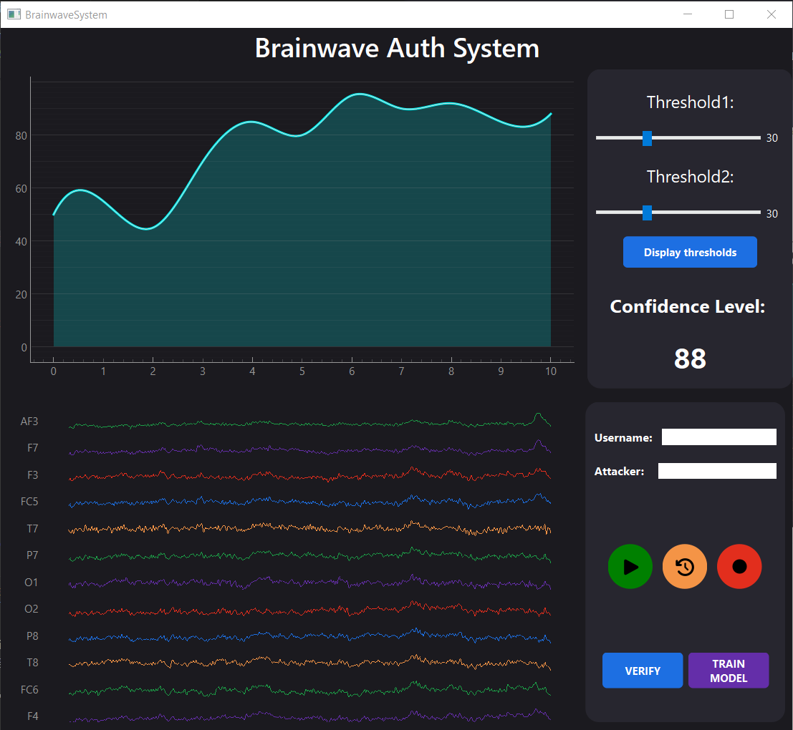
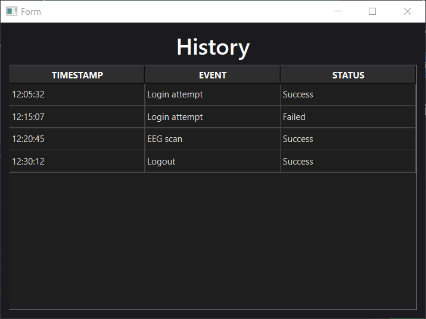

# GUI for Continuous Brainwave Authentication 

## Overview
This project presents a Python-based graphical user interface (GUI) for a continuous brainwave (EEG-based) authentication system. 
The application is designed as a prototype that demonstrates how users can interact with such a system, with a strong emphasis on usability and clarity.
The focus of the project lies on interface design and user interaction rather than on the implementation of the underlying authentication algorithms. 
Core aspects include EEG-data visualization, intuitive controls and a clean layout.

## Features
- User-friendly interface
- Clean and modern design
- EEG-data visualization
- Interactive controls (buttons, sliders, input fields)
- Authentication history view

## Screenshots

## Requirements
Ensure that Python 3.9 or higher is installed.

## Installing & Running the application
1. Clone the repository:
   <pre> git clone https://github.com/vasilevaE/Praktikum_EV.git </pre>

2. Navigate to the project directory:
   <pre> cd Praktikum_EV </pre>

3. Install dependencies:
   <pre> pip install -r requirements.txt </pre>

5. Run the application
   <pre> python main.py </pre>

## Future Improvements
There are several possible directions for future work and further improvements for the project.
Here are listed some of the proposed suggestions: 
 - Integration of application logic [mandatory]
 - Adding more functionalities
 - Error handling
 - Implementing light theme version [optional]
 - Implementing information tooltips & hints [making the GUI more beginner-friendly]
 - Evaluation through study (e.g. think-aloud sessions) [optional]

## Author
Elena Vasileva  
elena.vasileva@student.kit.edu  
Practical Course: Security, Usability and Society / KIT   
2026
